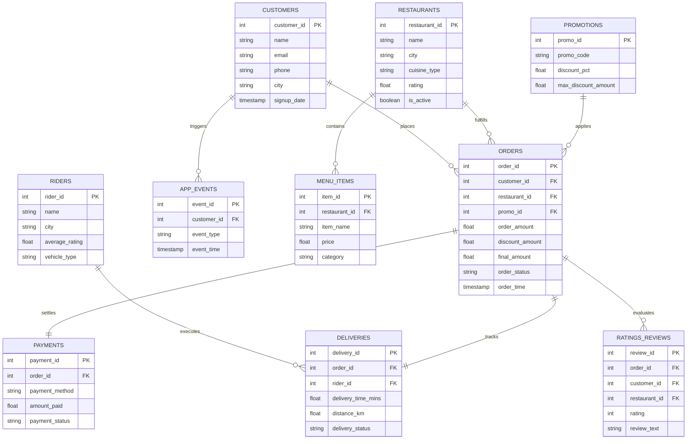

# Figure 2: Data Engineering & Validation Pipeline

```mermaid
flowchart LR
    subgraph DataGen ["Synthetic Data Generation"]
        FAKER["Faker & NumPy Engine<br/>(Metro Demographics & Order Simulation)"]
    end

    subgraph RawStage ["Raw Landing Stage"]
        RAW["10 Raw CSV Files<br/>(304,405 Rows Total)"]
    end

    subgraph ETLStage ["Python Cleaning & Normalization Pipeline"]
        ETL1["Deduplication & Null Handling"]
        ETL2["Referential Integrity Checking"]
        ETL3["Currency Normalization (INR)"]
        ETL4["Temporal Ordering & ISO Timestamping"]
    end

    subgraph CleanStage ["Cleaned Storage"]
        CLEAN["Cleaned CSV Store<br/>(datasets/cleaned/*.csv)"]
    end

    subgraph DBStage ["Database Ingestion & Mirrored Storage"]
        MYSQL["MySQL 8.0 Primary Store<br/>(InnoDB, 3NF, Foreign Key Constraints)"]
        SQLITE["SQLite Analytical In-Memory Mirror<br/>(Read-Only Thread-Safe Connection)"]
    end

    subgraph FeatureStage ["Feature Engineering & Analytical Views"]
        FEAT["Engineered DataFrames<br/>(RFM Segments, Rolling Delay, Merchant Score)"]
    end

    FAKER --> RAW
    RAW --> ETL1 --> ETL2 --> ETL3 --> ETL4
    ETL4 --> CLEAN
    CLEAN --> MYSQL
    CLEAN --> SQLITE
    MYSQL --> FEAT
    SQLITE --> FEAT
```

---

# Figure 3: Relational Database Schema & Foreign Key Constraints

```mermaid
erDiagram
    CUSTOMERS ||--o{ ORDERS : places
    CUSTOMERS ||--o{ APP_EVENTS : triggers
    RESTAURANTS ||--o{ MENU_ITEMS : contains
    RESTAURANTS ||--o{ ORDERS : fulfills
    RIDERS ||--o{ DELIVERIES : executes
    ORDERS ||--|| PAYMENTS : settles
    ORDERS ||--|| DELIVERIES : tracks
    ORDERS ||--o{ RATINGS_REVIEWS : evaluates
    PROMOTIONS ||--o{ ORDERS : applies

    CUSTOMERS {
        int customer_id PK
        string name
        string email
        string phone
        string city
        timestamp signup_date
    }

    RESTAURANTS {
        int restaurant_id PK
        string name
        string city
        string cuisine_type
        float rating
        boolean is_active
    }

    MENU_ITEMS {
        int item_id PK
        int restaurant_id FK
        string item_name
        float price
        string category
    }

    ORDERS {
        int order_id PK
        int customer_id FK
        int restaurant_id FK
        int promo_id FK
        float order_amount
        float discount_amount
        float final_amount
        string order_status
        timestamp order_time
    }

    PAYMENTS {
        int payment_id PK
        int order_id FK
        string payment_method
        float amount_paid
        string payment_status
    }

    DELIVERIES {
        int delivery_id PK
        int order_id FK
        int rider_id FK
        float delivery_time_mins
        float distance_km
        string delivery_status
    }

    RIDERS {
        int rider_id PK
        string name
        string city
        float average_rating
        string vehicle_type
    }

    RATINGS_REVIEWS {
        int review_id PK
        int order_id FK
        int customer_id FK
        int restaurant_id FK
        int rating
        string review_text
    }

    PROMOTIONS {
        int promo_id PK
        string promo_code
        float discount_pct
        float max_discount_amount
    }

    APP_EVENTS {
        int event_id PK
        int customer_id FK
        string event_type
        timestamp event_time
    }
```
