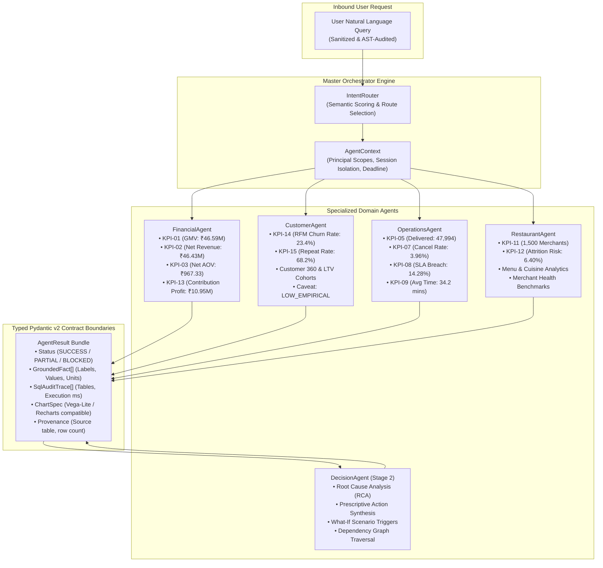
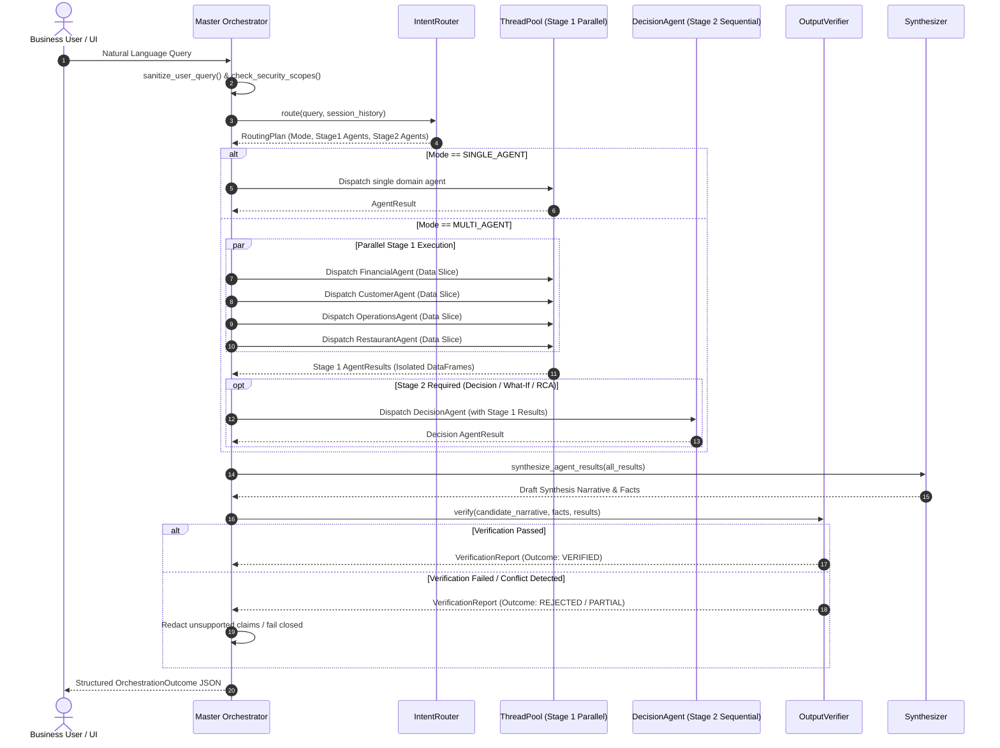

# Figure 4: Five-Agent Domain Architecture & Contract Boundaries

```mermaid
flowchart TD
    subgraph ClientReq ["Inbound User Request"]
        REQ["User Natural Language Query<br/>(Sanitized & AST-Audited)"]
    end

    subgraph OrchestrationHub ["Master Orchestrator Engine"]
        ROUTER["IntentRouter<br/>(Semantic Scoring & Route Selection)"]
        CTX["AgentContext<br/>(Principal Scopes, Session Isolation, Deadline)"]
    end

    subgraph DomainAgents ["Specialized Domain Agents"]
        FA["FinancialAgent<br/>• KPI-01 (GMV: ₹46.59M)<br/>• KPI-02 (Net Revenue: ₹46.43M)<br/>• KPI-03 (Net AOV: ₹967.33)<br/>• KPI-13 (Contribution Profit: ₹10.95M)"]
        CA["CustomerAgent<br/>• KPI-14 (RFM Churn Rate: 23.4%)<br/>• KPI-15 (Repeat Rate: 68.2%)<br/>• Customer 360 & LTV Cohorts<br/>• Caveat: LOW_EMPIRICAL"]
        OA["OperationsAgent<br/>• KPI-05 (Delivered: 47,994)<br/>• KPI-07 (Cancel Rate: 3.96%)<br/>• KPI-08 (SLA Breach: 14.28%)<br/>• KPI-09 (Avg Time: 34.2 mins)"]
        RA["RestaurantAgent<br/>• KPI-11 (1,500 Merchants)<br/>• KPI-12 (Attrition Risk: 6.40%)<br/>• Menu & Cuisine Analytics<br/>• Merchant Health Benchmarks"]
        DA["DecisionAgent (Stage 2)<br/>• Root Cause Analysis (RCA)<br/>• Prescriptive Action Synthesis<br/>• What-If Scenario Triggers<br/>• Dependency Graph Traversal"]
    end

    subgraph ContractBoundary ["Typed Pydantic v2 Contract Boundaries"]
        RES["AgentResult Bundle<br/>• Status (SUCCESS / PARTIAL / BLOCKED)<br/>• GroundedFact[] (Labels, Values, Units)<br/>• SqlAuditTrace[] (Tables, Execution ms)<br/>• ChartSpec (Vega-Lite / Recharts compatible)<br/>• Provenance (Source table, row count)"]
    end

    REQ --> ROUTER
    ROUTER --> CTX
    CTX --> FA & CA & OA & RA
    FA & CA & OA & RA --> RES
    RES --> DA
    DA --> RES
```

---

# Figure 5: Master Orchestrator Two-Stage Execution & Lifecycle

```mermaid
sequenceDiagram
    autonumber
    actor User as Business User / UI
    participant MO as Master Orchestrator
    participant IR as IntentRouter
    participant TP as ThreadPool (Stage 1 Parallel)
    participant DA as DecisionAgent (Stage 2 Sequential)
    participant OV as OutputVerifier
    participant SYN as Synthesizer

    User->>MO: Natural Language Query
    MO->>MO: sanitize_user_query() & check_security_scopes()
    MO->>IR: route(query, session_history)
    IR-->>MO: RoutingPlan (Mode, Stage1 Agents, Stage2 Agents)
    
    alt Mode == SINGLE_AGENT
        MO->>TP: Dispatch single domain agent
        TP-->>MO: AgentResult
    else Mode == MULTI_AGENT
        par Parallel Stage 1 Execution
            MO->>TP: Dispatch FinancialAgent (Data Slice)
            MO->>TP: Dispatch CustomerAgent (Data Slice)
            MO->>TP: Dispatch OperationsAgent (Data Slice)
            MO->>TP: Dispatch RestaurantAgent (Data Slice)
        end
        TP-->>MO: Stage 1 AgentResults (Isolated DataFrames)
        opt Stage 2 Required (Decision / What-If / RCA)
            MO->>DA: Dispatch DecisionAgent (with Stage 1 Results)
            DA-->>MO: Decision AgentResult
        end
    end

    MO->>SYN: synthesize_agent_results(all_results)
    SYN-->>MO: Draft Synthesis Narrative & Facts
    MO->>OV: verify(candidate_narrative, facts, results)
    
    alt Verification Passed
        OV-->>MO: VerificationReport (Outcome: VERIFIED)
    else Verification Failed / Conflict Detected
        OV-->>MO: VerificationReport (Outcome: REJECTED / PARTIAL)
        MO->>MO: Redact unsupported claims / fail closed
    end

    MO-->>User: Structured OrchestrationOutcome JSON
```
